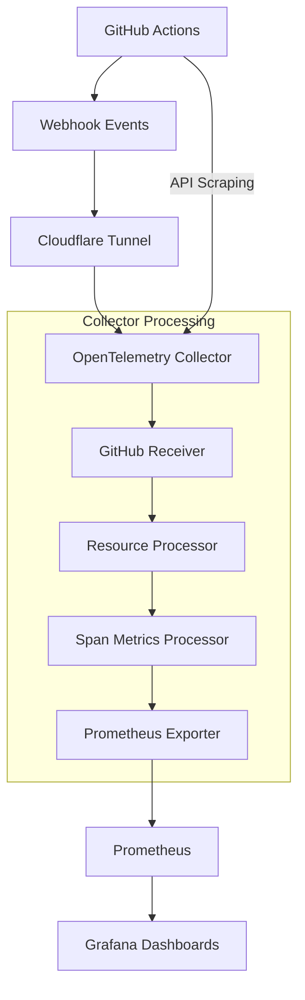

# 🧠 GitHub Actions Observability - Context & Decision History

## 📋 **PROJECT OVERVIEW**

**Goal**: Complete GitHub Actions observability solution with OpenTelemetry, Prometheus, and Grafana
**Status**: ✅ PRODUCTION READY - All issues resolved, security audited, documentation complete

## 🛠️ **FINAL ARCHITECTURE**



**Components:**
- **OpenTelemetry Collector** v0.135.0 with GitHub receiver
- **Prometheus** with 30-day retention  
- **Grafana** with 6 optimized dashboards
- **Cloudflare Tunnel** for secure webhook exposure

## 🎯 **CRITICAL DECISIONS & FIXES**

### 1. **Repository Data Filtering Issue** ⚠️→✅
**Problem**: Collector was scraping all 37+ repositories in GitHub org, showing wrong data
```yaml
# BEFORE (Wrong)
scrapers:
  scraper:
    github_org: vipulgupta2048  # Scraped ALL repos

# AFTER (Fixed) 
scrapers:
  scraper:
    github_org: ${GITHUB_ORG}
    search_query: "repo:${GITHUB_ORG}/${GITHUB_REPO}"  # Specific repo only
```
**Result**: Now only collects data from target repository

### 2. **Dashboard Compatibility Issues** ⚠️→✅  
**Problem**: Dashboards used `byRefId` matcher (deprecated in newer Grafana)
**Fix**: Updated all dashboards to use `byFrameRefID` 
**Impact**: All 6 dashboards now working correctly

### 3. **Dashboard Portfolio Optimization** 📊→🚀
**Changes**:
- ✅ **Merged**: "GitHub Actions Observability" + "GitHub Actions Overview" → Single comprehensive dashboard
- ✅ **Deleted**: "GitHub Actions Simple" (limited functionality)
- ✅ **Scaled**: Optimized "Workflow Details" for enterprise scale (hundreds of repos/workflows)
- ✅ **Enhanced**: All dashboards standardized to 24-hour time ranges

**Final Portfolio**: 6 production-ready dashboards
1. GitHub Actions Overview & Observability
2. GitHub Actions Workflow Health Overview  
3. GitHub Actions Workflow Details (Enterprise Scale)
4. GitHub Actions Workflow Exploration
5. GitHub Actions Repository Performance
6. GitHub Actions Complete Metrics (All Data Points)

### 4. **Security Hardening** 🔒→🛡️
**Critical Issues Fixed**:
- ❌ **REMOVED**: Real GitHub PAT and webhook secrets from git
- ✅ **ADDED**: Comprehensive `.gitignore` with secret patterns
- ✅ **CREATED**: `.env.example` with safe placeholder values
- ✅ **GENERICIZED**: All hardcoded values replaced with environment variables

## 📊 **METRICS & DATA FLOW**

### **Data Sources**:
1. **GitHub Webhooks** → Real-time workflow events (`workflow_run`, `workflow_job`)
2. **GitHub API Scraping** → VCS metrics (repositories, changes, PRs) 
3. **Span Metrics** → Generated from workflow traces

### **Available Metrics**:
```promql
# Workflow Metrics
github_actions_workflow_runs_total
github_actions_workflow_job_runs_total  
github_actions_workflow_run_duration_seconds

# VCS Metrics (from API scraping)
github_actions_vcs_repository_count
github_actions_vcs_change_count
github_actions_vcs_ref_count

# Span Metrics (generated internally)
traces_span_metrics_duration_milliseconds
traces_span_metrics_calls_total
```

## 🔧 **TECHNICAL CONFIGURATION**

### **Environment Variables** (Required):
```bash
GITHUB_TOKEN=ghp_your_token_here       # GitHub PAT with metadata:read, actions:read
GITHUB_WEBHOOK_SECRET=your_secret      # Random 32+ char string  
GITHUB_ORG=your_github_org             # Target organization
GITHUB_REPO=your_repo_name             # Target repository
```

### **Ports & Services**:
- **Collector**: `:9504` (webhooks), `:9464` (metrics)
- **Prometheus**: `:9090` (UI & API)
- **Grafana**: `:3000` (dashboards)

### **Data Retention**:
- **Prometheus**: 30 days
- **Grafana**: Persistent volumes for dashboards/config

## 🚀 **SETUP CHECKLIST**

For anyone reproducing this solution:

1. **Prerequisites**:
   - [ ] Docker & Docker Compose installed
   - [ ] GitHub repository with Actions workflows
   - [ ] GitHub PAT with required scopes
   - [ ] Cloudflared for tunnel (optional but recommended)

2. **Configuration**:
   - [ ] Copy `.env.example` to `.env` and fill values
   - [ ] Update collector config with your org/repo
   - [ ] Start services: `docker compose up -d`
   - [ ] Setup webhook pointing to tunnel URL

3. **Verification**:  
   - [ ] Check collector health: `curl localhost:9504/health`
   - [ ] Check metrics: `curl localhost:9464/metrics`
   - [ ] Trigger workflow and verify data in Grafana

## 🎓 **LESSONS LEARNED**

1. **GitHub Receiver Scope**: By default scrapes entire org - use `search_query` for filtering
2. **Dashboard Compatibility**: Newer Grafana versions require `byFrameRefID` not `byRefId`
3. **Security First**: Never commit real tokens - use environment variables and examples
4. **Portfolio Management**: Merge duplicates, remove limited dashboards, optimize for scale
5. **Documentation**: Comprehensive setup guide essential for reproducibility

## 📈 **ENTERPRISE READINESS**

This solution is designed for production use:
- ✅ **Scalability**: Handles hundreds of repos and workflows
- ✅ **Security**: Secrets properly managed, generic configuration
- ✅ **Monitoring**: Complete observability of CI/CD pipelines  
- ✅ **Documentation**: Full setup guide with troubleshooting
- ✅ **Maintenance**: Modular architecture, clear separation of concerns

## 🔄 **FUTURE ENHANCEMENTS**

Potential improvements:
- **Alerting**: Add Prometheus alerts for failed workflows
- **Custom Metrics**: Additional business-specific metrics
- **Multi-Org**: Support for multiple GitHub organizations
- **Advanced Dashboards**: More detailed analytics and insights
- **Integration**: Connect with other tools (Slack notifications, etc.)

---

**Last Updated**: September 19, 2025  
**Status**: Production Ready ✅  
**Security**: Audited & Secure 🛡️