# GitHub Actions Observability with OpenTelemetry

        D2[Workflow Health<br/>💚 Monitoring]omplete observability solution for GitHub Actions workflows using OpenTelemetry Collector, Prometheus, and Grafana. Monitor your CI/CD pipelines with distributed tracing, rich metrics, and real-time dashboards.

## 🎯 What You Get

- **📊 Complete Metrics**: Workflow execution rates, durations, success/failure rates
- **🔍 Distributed Traces**: Every workflow run as a detailed trace with job and step spans  
- **📈 Rich Dashboards**: 6 pre-built Grafana dashboards for different analysis needs
- **⚡ Real-time Data**: Live updates via GitHub webhooks with <15s latency
- **� VCS Insights**: Pull request metrics, code change analysis, merge times
- **❌ Failure Analysis**: Identify problematic workflows, steps, and patterns

## Architecture

```mermaid
graph LR
    %% Source
    GH[GitHub Repository<br/>🏠 Actions Triggered]
    
    %% Webhook Path (Horizontal)
    GH -->|"workflow_run<br/>workflow_job events"| WH[GitHub Webhook<br/>📡 POST /events]
    WH -->|"HTTPS POST"| CF[Cloudflare Tunnel<br/>🔒 Secure Proxy]
    CF -->|"localhost:9504"| GHR[GitHub Receiver<br/>🎯 Webhook Handler]
    
    %% Collector Processing Pipeline (Horizontal with vertical internals)
    subgraph COLLECTOR ["OpenTelemetry Collector 🔄"]
        direction TB
        GHR --> RP[Resource Processor<br/>🏷️ Metadata]
        RP --> AP[Attributes Processor<br/>🔧 Transform]
        AP --> BP[Batch Processor<br/>📦 Buffer]
        BP --> SMP[Span Metrics<br/>📊 RED Metrics]
        SMP --> PE[Prometheus Exporter<br/>📈 :9464]
    end
    
    %% Parallel API Scraping (Vertical compact)
    subgraph API ["GitHub API Scraping 🌐"]
        direction TB
        AUTH[Bearer Token Auth<br/>🔐 GitHub PAT] 
        AUTH --> GHS[GitHub Scraper<br/>🔍 REST API]
        GHS --> VCS[VCS Metrics<br/>📊 Repos, PRs]
    end
    
    %% Storage
    PE -->|"Scrape :9464/metrics"| PROM[Prometheus<br/>⚡ 30-day Storage]
    VCS -.->|"Additional metrics"| PE
    
    %% Visualization Layer
    subgraph DASHBOARDS ["Grafana Dashboards 📈"]
        direction TB
        D1[Overview & Observability<br/>📊 Executive KPIs]
        D2[Workflow Health<br/>� Monitoring] 
        D3[Complete Metrics<br/>📋 All Data Points]
        D4[Repository Performance<br/>🏆 Strategic Metrics]
    end
    
    %% Final connections
    PROM <-->|"PromQL queries"| DASHBOARDS
    USER[User Browser<br/>👤 :3000] --> DASHBOARDS
    
    %% Styling
    classDef github fill:#24292e,stroke:#f9826c,stroke-width:2px,color:#fff
    classDef tunnel fill:#f38020,stroke:#fff,stroke-width:2px,color:#fff  
    classDef collector fill:#326ce5,stroke:#fff,stroke-width:2px,color:#fff
    classDef storage fill:#e6522c,stroke:#fff,stroke-width:2px,color:#fff
    classDef dashboard fill:#f46800,stroke:#fff,stroke-width:2px,color:#fff
    classDef user fill:#00d924,stroke:#fff,stroke-width:2px,color:#fff
    
    class GH,WH github
    class CF tunnel
    class GHR,RP,AP,BP,SMP,PE,AUTH,GHS,VCS collector
    class PROM storage
    class D1,D2,D3,D4 dashboard
    class USER user
```



## 📋 Prerequisites

### Required Software
- **Docker Desktop**: Version 4.0+ with Docker Compose
- **Cloudflared**: For secure webhook tunneling
  ```bash
  # macOS (Homebrew)
  brew install cloudflare/cloudflare/cloudflared
  
  # Other platforms: https://developers.cloudflare.com/cloudflare-one/connections/connect-networks/downloads/
  ```

### GitHub Requirements
- **Repository**: A GitHub repository where you want to monitor workflows
- **Personal Access Token**: With these scopes:
  - `repo` (Full read repository access)
  - `workflow` (Read GitHub Action workflows)
  - `read:org` (Read organization membership)
- **Webhook Secret**: A secure random string (we'll generate this)

### System Requirements
- **RAM**: 4GB minimum (8GB recommended)
- **Disk**: 10GB free space for metrics storage
- **Network**: Stable internet for GitHub API and tunnel

## 🚀 Complete Setup Guide

### Step 1: Clone and Prepare

```bash
# Clone this repository
git clone <your-repo-url>
cd otel-official

# Make scripts executable
chmod +x start-tunnel.sh
```

### Step 2: Create GitHub Personal Access Token

1. Go to GitHub Settings → Developer settings → Personal access tokens → Tokens (classic)
2. Click "Generate new token (classic)"
3. Select scopes: `repo`, `workflow`, `read:org`
4. Copy the token (you won't see it again!)

### Step 3: Configure Environment

```bash
# Generate a secure webhook secret
openssl rand -hex 32

# Create environment file
cat > .env << EOF
# GitHub Personal Access Token (with repo, workflow, read:org scopes)
GITHUB_TOKEN=ghp_your_token_here

# Webhook secret for validating GitHub requests (use output from openssl command above)
GITHUB_WEBHOOK_SECRET=your_generated_secret_here
EOF
```

### Step 4: Start the Observability Stack

```bash
# Start all services (Collector, Prometheus, Grafana)
docker compose up -d

# Check all services are healthy
docker compose ps
```

Expected output:
```
NAME                    STATUS
otel-official-collector-1    Up 2 seconds
otel-official-grafana-1      Up 2 seconds  
otel-official-prometheus-1   Up 2 seconds
```

### Step 5: Create Secure Tunnel

```bash
# Start the Cloudflare tunnel
./start-tunnel.sh
```

This will output something like:
```
🚀 Starting Cloudflare Tunnel for GitHub Webhooks
==================================================

✅ Tunnel created: https://abc-def-123.trycloudflare.com

🔗 GitHub Webhook Configuration:
   URL: https://abc-def-123.trycloudflare.com/events
   Content-Type: application/json
   Secret: (use GITHUB_WEBHOOK_SECRET from .env)
   Events: ✅ Workflow runs, ✅ Workflow jobs

⚡ Collector Health: http://localhost:9504/health
📊 Grafana: http://localhost:3000 (admin/admin)
```

**Keep this terminal open!** The tunnel only works while this script is running.

### Step 6: Configure GitHub Webhook

1. Go to your GitHub repository you want to track
2. Navigate to **Settings** → **Webhooks** 
3. Click **Add webhook**
4. Configure:
   - **Payload URL**: `https://your-tunnel-url.trycloudflare.com/events`
   - **Content type**: `application/json`
   - **Secret**: Paste your `GITHUB_WEBHOOK_SECRET` from `.env`
   - **Events selection**: Choose "Let me select individual events"
   - **Select events**: ✅ Workflow runs, ✅ Workflow jobs
5. Click **Add webhook**

### Step 7: Test the Setup

```bash
# Test webhook endpoint health
curl https://your-tunnel-url.trycloudflare.com/health

# Trigger a workflow in your repository
git push origin main  # or trigger manually from GitHub Actions tab
```

### Step 8: Access Dashboards

Open http://localhost:3000 in your browser:
- **Username**: `admin`
- **Password**: `admin` (change on first login)

Prometheus Dashbaord is available at http://localhost:9090

## 📊 Available Dashboards

1. **GitHub Actions Overview & Observability** - Executive summary and KPIs
2. **GitHub Actions - Workflow Exploration** - Detailed drill-down analysis  
3. **GitHub Actions - Workflow Analysis** - Scalable pattern analysis
4. **GitHub Actions - Repository Performance** - Strategic performance metrics
5. **GitHub Actions - Workflow Health Overview** - Health monitoring
6. **GitHub Actions - Complete Metrics** - Every available data point visualized

## 🔧 Configuration Details

### Collector Configuration (`collector-config.yaml`)

The OpenTelemetry Collector is configured with:
- **GitHub Receiver**: Webhook on port 9504, API scraping limited to your repository
- **Span Metrics Processor**: Generates RED metrics from traces
- **Prometheus Exporter**: Metrics on port 9464
- **Resource Processor**: Adds service metadata

### Key Metrics Generated

**From Webhooks (Traces → Span Metrics):**
```
github_actions_traces_span_metrics_calls_total{service_name="github-actions"}
github_actions_traces_span_metrics_duration_seconds{service_name="github-actions"}
```

**From GitHub API Scraping:**
```
github_actions_vcs_repository_count
github_actions_vcs_change_count{vcs_repository_name="your-repo"}
github_actions_vcs_change_duration_seconds{vcs_repository_name="your-repo"}
github_actions_vcs_ref_count{vcs_repository_name="your-repo"}
```

## 🛠️ Troubleshooting

### No Data in Dashboards

1. **Check webhook delivery**:
   - GitHub repo → Settings → Webhooks → Recent Deliveries
   - Look for 200 responses
   
2. **Verify collector is receiving data**:
   ```bash
   docker compose logs collector | grep "github"
   ```

3. **Test tunnel connectivity**:
   ```bash
   curl https://your-tunnel-url.trycloudflare.com/health
   ```

4. **Check Prometheus targets**: http://localhost:9090/targets
   - `otel-collector` should be "UP"

5. Takes a minute or two.

## 🎓 Understanding the Data Flow


## 📦 Docker Services

| Service | Port | Purpose | Data Volume |
|---------|------|---------|-------------|
| **collector** | 9504, 9464 | OpenTelemetry data collection | `otel_data` |
| **prometheus** | 9090 | Metrics storage (30 days) | `prometheus_data` |
| **grafana** | 3000 | Dashboards and visualization | `grafana_data` |

## 🔗 Service Dependencies

```
grafana depends_on → prometheus depends_on → collector
```

All services are connected via the `observability` Docker network.


## 🎯 Success Indicators

After setup, you should see:

1. **GitHub Webhook**: ✅ Green checkmark in GitHub webhook settings
2. **Collector Logs**: Messages about receiving webhook events
3. **Prometheus Metrics**: Data visible at http://localhost:9090/graph
4. **Grafana Dashboards**: Populated charts with workflow data

## 📈 Sample Queries

Test these in Prometheus (http://localhost:9090):

```promql
# Workflow execution rate
rate(github_actions_traces_span_metrics_calls_total[5m])

# Repository activity 
github_actions_vcs_change_count{vcs_repository_name="your-repo"}

# Average workflow duration
rate(github_actions_traces_span_metrics_duration_seconds_sum[5m]) / 
rate(github_actions_traces_span_metrics_duration_seconds_count[5m])
```

## 🔧 Advanced Configuration

### Custom Repository Filtering
Edit `collector-config.yaml`:
```yaml
scrapers:
  scraper:
    github_org: your-org
    search_query: "repo:your-org/repo1 OR repo:your-org/repo2"
```

### Webhook Path Customization
```yaml
github:
  webhook:
    path: "/custom-webhook-path"
    health_path: "/custom-health"
```

### Metrics Retention
Edit `docker-compose.yml`:
```yaml
prometheus:
  command:
    - "--storage.tsdb.retention.time=90d"  # 90 days instead of 30
```

## 🛡️ Security Best Practices

### GitHub Token Security
- Use fine-grained Personal Access Tokens when possible
- Limit token scope to only required repositories
- Rotate tokens regularly (every 90 days)
- Store tokens in secure password managers

### Webhook Security
- Always use a strong, random webhook secret
- Regularly rotate webhook secrets
- Monitor webhook delivery logs for suspicious activity

### Infrastructure Security
- Use strong Grafana admin password
- Consider implementing reverse proxy with authentication
- Monitor collector logs for unauthorized access attempts
- Regularly update Docker images

